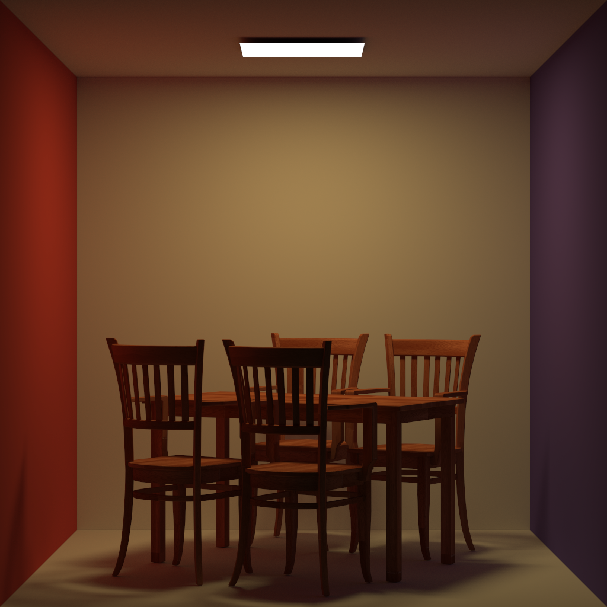
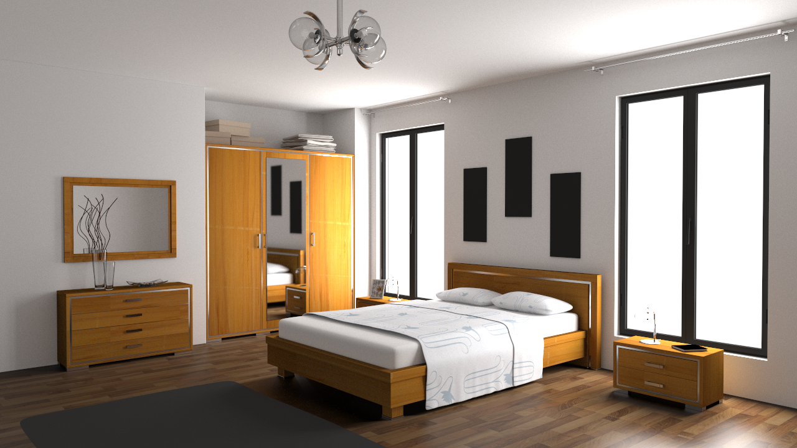

### 蒙特卡洛路径追踪渲染器实验报告

22121179 吴佳豪

#### 1.实验环境

- 操作系统：Windows
- IDE: CLION
- CMAKE版本: 3.17及以上
- C++版本：17及以上

*编译说明*：在项目根目录下，命令行执行

``` bash
cmake .
```

即可进行编译并生成.exe可执行文件或.sin工程文件。


#### 2.项目结构

##### 2.1外部依赖

项目的外部依赖库有:

+ glm

  开源的opengl数学库，加速矢量和矩阵运算。

+ OBJ_Loader

  开源的obj模型读取库，可读取.obj, .mtl等文件格式。

+ stb_image

  开源的image处理库，可读取各种格式的图片，此处用于读取纹理图片。

以上3个外部依赖库的头文件均在项目的include文件夹中。


##### 2.2类

为了实现一个蒙特卡洛路径追踪渲染器，设计了以下的类。

###### *2.2.1物体类(Object)*

```C++
class Object {
public:
    Material* m = nullptr;
    AABB bounding_box;
    Object() {
        m = nullptr;
    }
    virtual float get_area() = 0;
    virtual void sample(Intersection& inter, float& pdf) = 0;
    virtual Intersection get_intersection(const Ray& ray) = 0;
};
```

物体类是一个抽象基类，具有的属性包括物体的材质和对应的包围盒，物体类需要实现以下接口：求物体的表面积，均匀随机在物体表面采样一个点，求光线与物体的交点。在本项目中，我们实现了三角形和球两种物体。


###### *2.2.2三角形类(Triangle)*

```c++
class Triangle: public Object{
public:
    vec3 v[3];
    vec3 vn[3];
    vec2 tex[3];
    vec3 normal;
    vec3 e1;
    vec3 e2;
public:
    Triangle() = default;
    Triangle(vec3 v0, vec3 v1, vec3 v2, Material* m);
    Triangle(vec3 v0, vec3 v1, vec3 v2, vec3 n0, vec3 n1, vec3 n2, vec2 t0, vec2 t1, vec2 t2, Material *mtl);
    float get_area() override;
    Intersection get_intersection(const Ray& ray) override;
    void sample(Intersection& inter, float& pdf) override;
};
```

三角形类继承了物体类并实现了其中的方法。三角形额外的属性包括：三角形的原始顶点、三角形的原始顶点法线、三角形的原始顶点纹理坐标、三角形的两条边(*e1 = v[1] - v[0], e2 = v[2] - v[0]*), 三角形的面法线(*normal = glm::normalize(glm::cross(e1, e2));*)。三角形与光线的求交使用Möller-Trumbore算法，sample方法可以通过随机重心坐标进行计算。


###### *2.2.3网格类(Mesh)*

```c++
class Mesh: public Object {
public:
    std::vector<Object*> prims;
    BVH* bvh;
public:
    explicit Mesh(const std::vector<Object*>& objects);
    float get_area() override;
    Intersection get_intersection(const Ray& ray) override;
    void sample(Intersection& inter, float& pdf) override;
};
```

网格类同样也是对Object类进行继承并实现其中的方法，mesh由许多三角形面片构成，并使用bvh组织这些面片，mesh的get_area，get_intersection，sample方法实际上都调用的是BVH类的相应方法。


###### *2.2.4球类(Sphere)*

```c++
class Sphere: public Object {
public:
    vec3 center;
    float radius;
public:
    Sphere(vec3 c, float r);
    float get_area() override ;
    void sample(Intersection& inter, float& pdf) override;
    Intersection get_intersection(const Ray& ray) override;
};
```

球类继承了物体类并实现了其中的方法。使用球的中心坐标和球的半径来表示一个球，求球的表面积以及在球的表面随机采样比较简单，光线与球的求交即解一个一元二次方程。


###### *2.2.5材质类(Material)*

```c++
enum MATERIAL_TYPE {
    DIFFUSE,
    MICRO_FACET,
    MIRROR,
    GLASS,
    PHONG
};

class Material {
public:
    MATERIAL_TYPE type;
    float roughness = 0.1;
    float metallic = 0.0;
    float ior = 1.0;
    float shine_exponent;
    vec3 Kd;
    vec3 Ks;
    vec3 emit;
    std::string map_kd;
    std::string map_ks;
    bool has_emission;
    Texture* texture = nullptr;
public:
    Material();
    Material(MATERIAL_TYPE t, const vec3& kd, const vec3& ks, const vec3& e, const float& i, const float& shine_exponent = 32.0, std::string  map_kd = "", std::string  map_ks = "");
    vec3 sample(const vec3& N, const vec3& wo) const;
    vec3 eval(const vec3 &N, const vec3 &wo, const vec3 &wi, const vec3 &KD) const;
    float pdf(const vec3& N, const vec3& wo, const vec3& wi) const;
}
```

材质类是蒙特卡洛路径追踪的核心，材质定义了物体表面如何与光线作用。我们实现了5种材质：漫反射材质，微表面材质，完美镜面反射材质(MIRROR),玻璃折射材质(GLASS),冯氏材质(PHONG)。材质有以下属性：折射率(ior), 高光指数(specular项中的exponent，.mtl文件中的Ns项)，漫反射系数(Kd), 高光系数(Ks), 纹理贴图路径(map_kd), 高光贴图路径(map_ks), 自身发光强度(emit)。

材质类实现了以下三个方法：sample，根据光线的出射方向，随机采样光线的入射方向。eval，根据光线的出射方向和光线的入射方向，计算对应的brdf。pdf，根据光线的出射方向和光线的入射方向，计算对应的pdf。


+ 漫反射材质

  漫反射材质实现较为简单。

  sample函数在半球内随机均匀采样即可，得到的向量是局部坐标系中的，需要根据法向量转换到世界坐标系中。

  brdf相应也是均匀的

  ```c++
  brdf = Kd / PI;
  ```

  pdf同理

  ``` 
  pdf = 0.5f / PI;
  ```

  

+ 微表面材质

  

​		微表面材质使用cook-torrance模型，前半部分是漫反射项，与漫反射材质处理类似，后半部分是镜面反射项。定义如下


​		D,F,G分别是法线分布函数，菲涅尔项，几何函数。

​		其中D我们使用的是Trowbridge-Reitz GGX：


​		F我们使用的是Fresnel-Schlick近似：


​		G我们使用的是Schlick-GGX：


+ 完美镜面反射材质

  sample函数返回完美镜面反射方向：

  ``` c++
  wi = reflect(N, wo);
  ```

  eval函数返回brdf:

  ```c++
  brdf = Ks / std::max(glm::dot(wi, N), EPSILON);
  ```

  pdf直接返回1

  ```
  pdf = 1;
  ```


+ 玻璃折射材质

  入射光线在玻璃表面发生折射和反射，各自的能量占比由菲涅尔项决定。

  sample函数根据菲涅尔项返回折射方向或者镜面反射方向：

  ``` c++
  float f = fresnel(N, wo, ior);
  float p = get_random_float();
  if (p <= f) {
  	return reflect(N, wo);
  } else {
  	return refract(N, wo, ior);
  }
  ```

  eval函数返回brdf

  ```c++
  if (wi == reflect(N, wo)) {
      return Ks / glm::dot(wi, N);
  }
  if (wi == refract(N, wo, ior)) {
      return Ks / std::abs(glm::dot(wi, N));
  }
  ```

 pdf 返回1即可


+ PHONG材质

  sample函数在出射方向的完美镜面方向根据高光指数项进行微小扰动得到入射方向。

  ``` c++
  float x1 = get_random_float();
  float x2 = get_random_float();
  float theta = std::acos(std::pow(x1, 1.0f / (shine_exponent + 1.0f)));
  float t = std::pow(x1, 2.0f / (shine_exponent + 1.0f));
  float z = std::sqrt(t);
  float r = std::sqrt(1.0f - z * z);
  float phi = x2 * 2.0f * PI;
  float x = r * std::cos(phi);
  float y = r * std::sin(phi);
  vec3 reflect_dir = reflect(N, wo);
  vec3 local_wi = {x, y, z};
  vec3 world_wi = toWorld(local_wi, reflect_dir);
  return world_wi;
  ```

  brdf包含漫反射项和镜面反射项，镜面反射项根据入射方向与完美镜面反射方向的夹角和高光指数项计算。

  ```C++
  vec3 diffuse = my_Kd / PI;
  vec3 reflect_dir = reflect(N, wo);
  float cos_phi = glm::dot(wi, reflect_dir);
  vec3 specular = my_Ks * std::pow(cos_phi, shine_exponent) * (shine_exponent + 2.0f) / (2.0f * PI);
  return diffuse + specular;
  ```

  pdf计算方式与brdf类似

  ```c++
  vec3 reflect_dir = reflect(N, wo);
  float cos_phi = glm::dot(reflect_dir, wi);
  return std::pow(cos_phi, shine_exponent) * (shine_exponent + 1.0f) / (2.0f * PI);
  ```

  

###### *2.2.6光线类(Ray)*

```c++
class Ray {
public:
    vec3 ori = {};
    vec3 dir = {};
    float min_t;
}
```

ray = origin + t * *direction*, 光线需要一个起始位置和方向确定，还可以提供一个可选的最小t值。


###### *2.2.7交点类(Intersection)*

```c++
class Intersection {
public:
    bool has;
    vec3 pos = {};
    vec3 normal = {};
    Object* obj;
    Material* m;
    double t;
    double b1;
    double b2;
}
```

交点类，包含以下属性：是否相交，相交的位置，相交处的法向量，所交的面片(指针)，所交面片的材质，相交处的距离(*t*)，相交处的重心坐标b1，b2(对于三角形)。


###### *2.2.8包围盒类(AABB)*

包围盒类，用两个vec3向量即可表示，使用包围盒加速光线与场景bvh的求交过程。需要注意的是包围盒与光线相交的条件。

```c++
return t_enter <= t_exit && t_exit >= 0.0f;
```

由于三角形面片可能与xoy平面或yoz平面或xoz平面平行，因此光线进入与离开其包围盒的时间可能相等。


###### *2.2.9层次包围盒类(BVH)*

层次包围盒类，对场景进行管理。其中BVH的节点定义如下。

``` c++
struct BvhNode {
    AABB bounding_box;
    Object *obj = nullptr;
    BvhNode *left = nullptr;
    BvhNode *right = nullptr;
    float area = 0.0f;
};
```

每个BVH节点有一个包围盒，有指向两个子节点的指针，保存了该BVH节点所有面片的面积和，如果该节点是叶节点，那么它的obj指针会指向相应的三角形面片。

```c++
class BVH {
public:
    BvhNode *root;
    std::vector<Object *> objects;
public:
    BVH(const std::vector<Object *> &objs);
	BvhNode *recursive_build(Object **objs, size_t length);
    Intersection get_intersection(BvhNode *node, const Ray &ray);
```

在BVH类中，保存指向场景BVH根节点的指针，以及包含所有原始三角形面片的vector。BVH类提供两个操作：BVH的构建及BVH与光线的求交。

在BVH构建中，划分策略是找到当前节点包围盒最长的轴，在该维度上在所有三角形面片进行排序，并将面片分成两部分在两个子节点中进行递归的划分。

```c++
Intersection get_intersection(BvhNode *node, const Ray &ray) {
    Intersection inter;
    if (!node->bounding_box.intersect(ray)) {
        return inter;
    }

    if (node->left == nullptr && node->right == nullptr) {
        return node->obj->get_intersection(ray);
    } else {
        Intersection inter_left = get_intersection(node->left, ray);
        Intersection inter_right = get_intersection(node->right, ray);
        if (inter_left.t < inter_right.t) {
            return inter_left;
        } else {
            return inter_right;
        }
    }
}
```

在BVH与光线的求交中，如果光线与BVH节点的包围盒都不相交，则返回不相交。否则，如果该节点是叶节点，则使用光线与该叶节点中的面片进行求交，如果该节点为非叶节点，则在两个子节点中进行递归的求交，并返回较近的那个交点。


###### *2.2.10纹理类(Texture)*

```c++
class Texture {
    std::vector<glm::u8vec3> image;
public:
    int width, height;
    explicit Texture(const char *filename);
    const glm::u8vec3 *operator[](size_t row) const noexcept;
    glm::u8vec3 *operator[](size_t row) noexcept;
};
```

纹理类保存一张纹理图片的原始数据，并提供根据坐标查询相应颜色值的方法。


###### *2.2.11摄像机类(Camera)*

```c++
class Camera {
public:
    vec3 eye;
    vec3 look_at;
    vec3 up;
    float fov;
    int width;
    int height;
public:
    Camera() = default;
    Camera(vec3 e, vec3 center, vec3 world_up, float fov, int w, int h): eye(e), look_at(center), up(world_up), fov(fov), width(w), height(h) {}
    mat4 get_view_matrix() const {
        return glm::lookAt(eye, look_at, up);
    }
};
```

摄像机类需要相机位置(eye)，相机朝向(look_at), 相机上向量(up), field of view(fov)，生成图片的宽度与高度。摄像机的参数由提供的.xml文件给出。


###### *2.2.12场景类(Scene)*

```c++
class Scene {
public:
    float rr = 0.8;
    int max_depth = 10;
    std::vector<Object*> objects;
    BVH* bvh;
    Camera camera;
    bool using_mis = true;

public:
    Scene() = default;
    explicit Scene(Camera& cam);
    void add_obj(Object* obj);
    void build_bvh();
    Intersection intersect(const Ray& ray) const;
    void sample_light(Intersection& inter, float& pdf);
    vec3 castRay(const Ray& ray, int depth);
    vec3 calculate_direct_light(const Ray &ray, const Intersection &inter, const vec3 &kd, float &pdf);
};
```

场景类包含以下属性: Roussian Roulette概率(rr = 0.8)，光线bounce最大次数(max_depth = 10), 指向场景对应BVH类的指针，场景对应的摄像机，场景提供了以下方法：向场景中添加物体，构建场景的bvh，光线与场景求交，对光源进行随机采样，对光线与场景的交点进行着色等。

其中核心函数为castRay函数：

```c++
vec3 Scene::castRay(const Ray &ray, int depth) {
    const float max_radiance = 10.0f;
    vec3 wo = -ray.dir;
    if (depth > max_depth) {
        return vec3(0.0f);
    }
    Intersection inter = intersect(ray);
    if (!inter.has) {
        return vec3(0.0f);
    }
    if (inter.m->has_emission && depth == 0) {
        return glm::fclamp(inter.m->emit, 0.0f, 1.0f);
    }
    bool has_texture = false;
    vec3 kd = get_intersection_color(inter, has_texture);

    float light_pdf = 0.0f;
    vec3 L_dir_light = calculate_direct_light(ray, inter, kd, light_pdf);

    // sample brdf
    vec3 wi = inter.m->sample(inter.normal, wo);
    float pdf = inter.m->pdf(inter.normal, wo, wi);
    Ray obj_ray(inter.pos, wi);
    Intersection obj_ray_inter = intersect(obj_ray);

    // not hit
    if (!obj_ray_inter.has) {
        return glm::fclamp(L_dir_light, 0.0f, max_radiance);
    }

    bool hit_light = obj_ray_inter.m->has_emission && glm::dot(wi, obj_ray_inter.normal) < 0.01f;
    float brdf_pdf = 0.0f;
    vec3 L_dir_brdf(0.0f);

    // if wi hits light, no indirect light,
    vec3 color(0.0f);
    if (hit_light) {
        brdf_pdf = pdf;
        L_dir_brdf = obj_ray_inter.m->emit
                 * inter.m->eval(inter.normal, wo, wi, kd)
                 * glm::dot(inter.normal, wi)
                 / brdf_pdf;
        float light_pdf2 = std::pow(light_pdf, 2.0f);
        float brdf_pdf2 = std::pow(brdf_pdf, 2.0f);
        float denominator = light_pdf2 + brdf_pdf2;
        vec3 L_dir = L_dir_light * light_pdf2 / denominator + L_dir_brdf * brdf_pdf2 / denominator;
        color = L_dir;
        if (!using_mis) {
            color = L_dir_light;
        }
    }
    // if wi hits an object, indirect light
    else {
        float p = get_random_float();
        if (p > rr) {
            return glm::fclamp(L_dir_light, 0.0f, max_radiance);
        }
        vec3 L_in_dir = castRay(obj_ray, depth + 1)
                   * inter.m->eval(inter.normal, wo, wi, kd)
                   * std::abs(glm::dot(inter.normal, wi))
                   / (pdf * rr);
        color = L_dir_light + L_in_dir;
    }
    if (isnan(color.x) || isnan(color.y) || isnan(color.z)) {
        color = {0.0f, 0.0f, 0.0f};
    }
    return glm::fclamp(color, 0.0f, max_radiance);
}
```

首先光线与场景进行求交，若没有交点，则返回，第一次打到光源则返回光源对应的emit，首先求直接光的贡献，对光源进行采样计算。然后求对brdf的采样，如果采样到的光线击中光源，则多重重要性采样通过pdf对两项进行加权；如果击中非光源，则计算间接光的贡献。


###### *2.2.13渲染器类(Renderer)*

```c++
class Renderer {
public:
    Scene scene;
    std::vector<vec3> frame_buffer;
    std::vector<uint8_t> image;
public:
    Renderer(Scene& s);
    void render(int spp);
    void write_to_file(const std::string& filename);
};
```

渲染器类中包含以下属性: 对应的场景类，帧缓冲，以及一个uint8_t类型的vector，用于将最后的图片输出为.png格式。实现了render函数，调用scene的castRay函数并将结果写入到image中，最后调用write_to_file函数输出为.png图像。

其中核心函数是render函数:

```c++
void Renderer::render(int spp) {
    int width = scene.width;
    int height = scene.height;
    Camera camera = scene.camera;
    float scale = tan(camera.fov * 0.5 * PI / 180.0);
    float imageAspectRatio = width / (float) height;
    glm::mat4 view = camera.get_view_matrix();
    glm::mat4 inverse_view = glm::inverse(view);

    // change the spp value to change sample amount
    for (uint32_t j = 0; j < height; ++j) {
        int threads = std::thread::hardware_concurrency();
        int offset = width / threads;
        std::vector<std::future<void>> futures;

        for (uint32_t i = 0; i < threads; ++i) {
            int begin_offset = offset * i;
            int end_offset = i + 1 == threads ? width : begin_offset + offset;

            std::future<void> task = std::async(std::launch::async, [&](int begin_offset, int end_offset) {
                for (int i = begin_offset; i < end_offset; ++i) {
                    vec3 color(0.0f);

                    // generate primary ray direction
                    for (int k = 0; k < spp; k++) {
                        float x = (2 * (i + get_random_float()) / (float)width - 1) *
                                  imageAspectRatio * scale;
                        float y = (1 - 2 * (j + get_random_float()) / (float)height) * scale;
                        vec3 dir = glm::normalize(inverse_view * vec4(vec3(x, y, -1.0f), 0.0f));
                        color += scene.castRay(Ray(camera.eye, dir), 0) / (float)spp;
                    }
                    frame_buffer[j * width + i] = color;
                }
            }, begin_offset, end_offset);
            futures.emplace_back(std::move(task));
        }
        update_progress(j / (float) height);
    }
    update_progress(1.f);
}
```

由相机的参数可以得到相机的look_at矩阵，并求其逆矩阵，将该矩阵乘上相机坐标系中的光线方向向量即可得到世界坐标系中的光线方向向量。使用C++的future特性进行多线程并行计算。在每个spp的计算中，对像素中心坐标进行微小扰动(仍在该像素范围内)，通过多个spp的加权平均，即可达到抗锯齿的效果。


#### 3.运行结果

##### 3.1 场景：Cornell Box with Tables and Chairs

场景中所有物体都使用漫反射材质, spp4096得到如下结果。



##### 3.2 场景：Veach MIS

场景中背景墙使用漫反射材质，四条金属片使用PHONG材质，在直接光的计算中，使用了多重重要性采样。将直接光的贡献分成两个部分：对光源采样，对brdf进行采样。如果仅仅对直接光进行采样，则结果图片的左上方区域噪点很多，这是因为最上面一条金属片的Ns很大，类似完美镜面反射，而最左边的光源又很大，入射光基本不会在出射光的镜面反射方向。如果仅仅对金属片的brdf进行采样，则结果图片的右下方噪点很多，这是因为最下面一条金属片的Ns较小，不是完美的镜面反射，给定出射光线方向，通过brdf采样得到的入射光线方向很难击中最小的那个光源。通过多重重要性采样将两者结合，设置spp为10240，可以得到以下的结果。


##### 3.3 场景： Bedroom

该场景内物体较多，折射率不为1的物体如顶灯、花瓶和台灯使用玻璃材质处理。Ns不为1的物体使用PHONG材质处理，其余材质默认使用漫反射材质处理。使用多重重要性采样，设置spp为8192得到如下结果。



##### 3.4 自设场景： Cornell Box with Metal Sphere

场景中的物体使用2.2.4中的球类，材质为Microfacet材质，设置metallic为1.0，roughness为0.1，并为不同的球设置不同的Ks值，可以实现有色金属球的效果，设置spp为4096得到如下图片。


#### 4.性能测试

对Cornell Box with Tables and Chairs，Veach Mis，Bedroom进行性能测试(设置spp为16)。

CPU: Intel(R) Core(TM) i9-10900K CPU @ 3.70GHz   3.70 GHz

使用多线程，CPU占用率100%

| spp：16     | Cornell Box with Tables and Chairs        | Veach Mis                               | Bedroom                                   |
| ----------- | ----------------------------------------- | --------------------------------------- | ----------------------------------------- |
| 面片数目    | 15056                                     | 3812                                    | 441754                                    |
| bvh构建时间 | 8ms                                       | 4ms                                     | 272ms                                     |
| 渲染时间    | 26.3s                                     | 10.8s                                   | 119.60s                                   |
| 渲染结果    |  |  |  |

bvh的构建时间与渲染时间相比可以忽略不记，测试发现渲染过程时间主要消耗在光线与场景求交中，在scene的castRay函数中有3次光线与场景的求交。特别是面片数目较多(441754)的bedroom场景，bvh深度交大，求交耗时较长。个人在调试过程中使用过intel的embree光线求交加速库替换自己所写的求交方法，性能有巨大提升，设置spp=16的情况下，bedroom场景渲染费时8秒，求交的效率有10倍的提升，因此，光线与场景的求交加速是本项目之后需要优化改善的地方。


